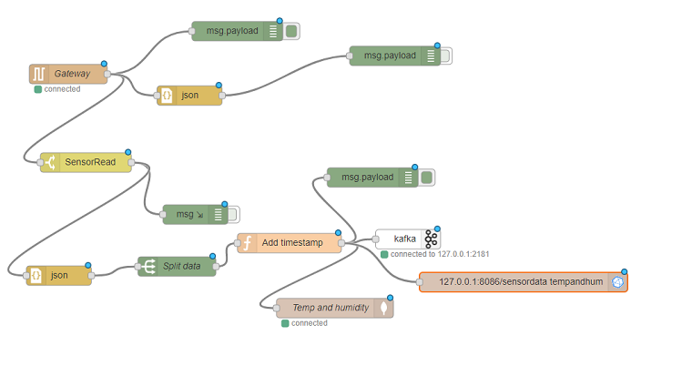
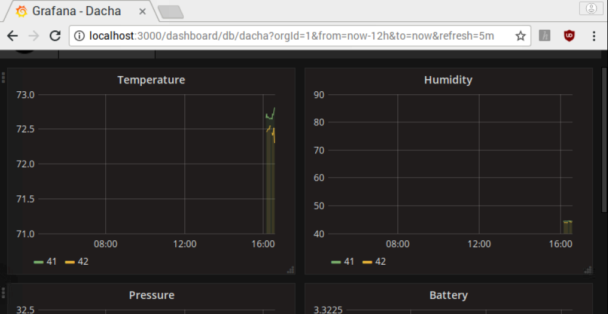

# Dacha

Home automation for our remote home.

The hub is a Raspberry Pi tethered to a GSM module, over serial connection.

It is also connected to a 433mHz RF gateway that receives temperature, humidity readings along with battery condition from multiple sensors running on battery.

Sensors are using HopeRF RFM69 radios, controlled by Arduino compatible microcontrollers. The sensors are BME280, which are highly accurate in reading temperature and humidity.

Here is how the sensors look like:

And the R/F gateway connected to the Pi.

Pi Zero with the camera:

# What Happens on the Gateway?
The sensors send data, only if there was a change detected during the N seconds (set in the code),or every N seconds.

A Node-Red server runs on the gateway Pi, with the following flow.

Every time a packet is received on the gateway, it gets parsed, a timestamp is added (I maintain a synchronized time on the gateway), pushed to a Kafka topic (I will add a stream processing task later), also pushed to a local influxDb instance and MongoDB (why not? :))

There is a Grafana server running on the box, that displays the values from the influxDB database.

Here is how the dashboard looks like:

