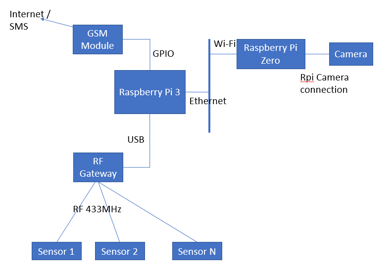
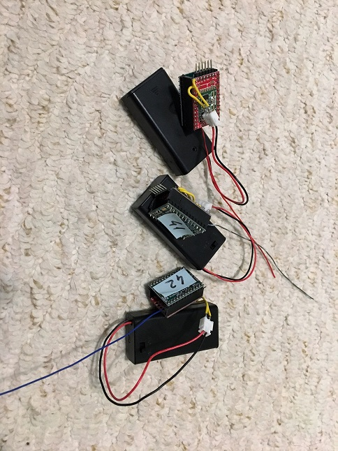

# Dacha

Home automation for our remote home.

The hub is a Raspberry Pi tethered to a GSM module, over serial connection.

It is also connected to a 433mHz RF gateway that receives temperature, humidity readings along with battery condition from multiple sensors running on battery.

Sensors are using HopeRF RFM69 radios, controlled by Arduino compatible microcontrollers. The sensors are BME280, which are highly accurate in reading temperature and humidity.

Here is how the sensors look like:

And the R/F gateway connected to the Pi.

Pi Zero with the camera:

